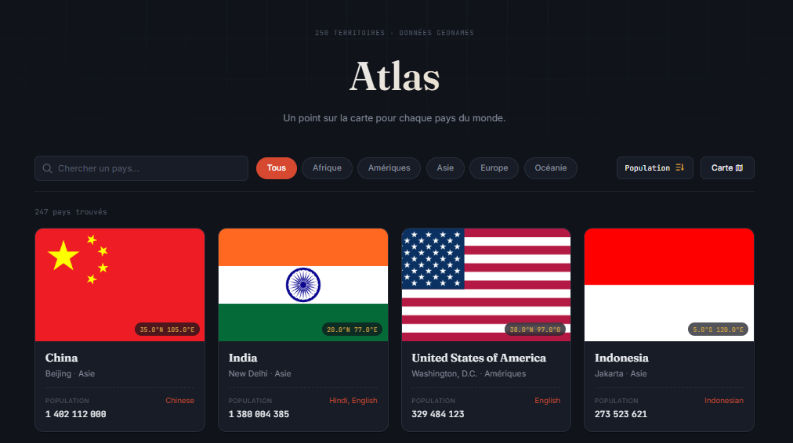
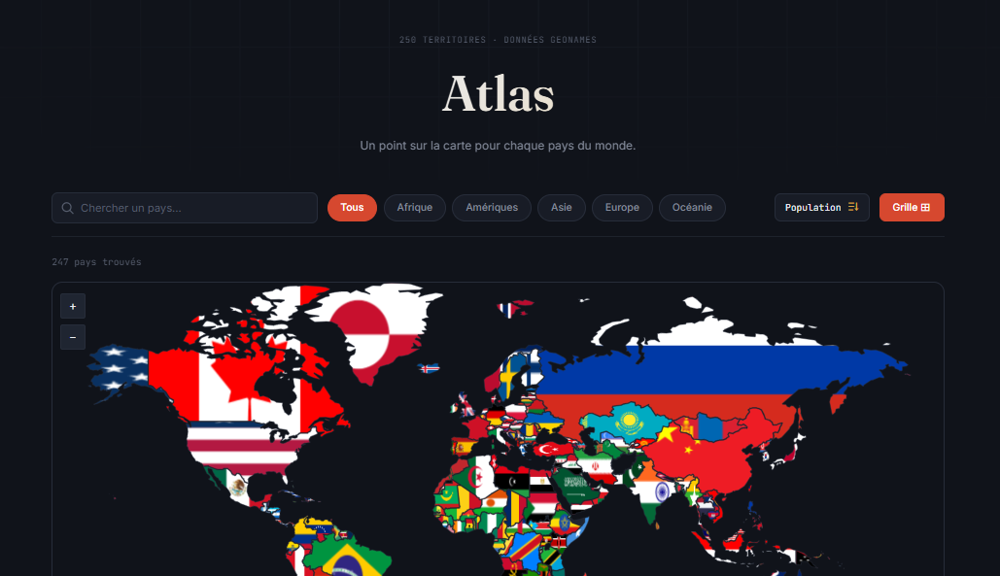

# Atlas

Atlas est un explorateur de pays réalisé avec HTML, CSS et JavaScript natif. Il permet de consulter la liste des pays, de les rechercher, de les filtrer par continent, de les trier par population et de les explorer sur une carte.






## Démo

- GitHub Pages : https://osiris-balonga.github.io/countries-explorer/
- Dépôt : https://github.com/Osiris-Balonga/countries-explorer

## Fonctionnalités

- rechercher un pays par son nom
- filtrer les pays par continent
- trier la population par ordre croissant ou décroissant
- afficher le drapeau, la capitale, le continent, les langues et la population
- basculer entre une grille de cartes et une carte interactive
- ouvrir une fiche pays avec ses repères, ses voisins, sa météo et des indicateurs récents
- gérer les états de chargement, de liste vide et d'erreur réseau
- adapter l'interface aux écrans mobiles et respecter `prefers-reduced-motion`

## Lancer le projet

Ouvrir `index.html` avec un serveur statique, par exemple :

```bash
python -m http.server 8000
```

Puis visiter `http://localhost:8000`.

## Organisation

```text
countries-explorer/
|-- assets/images/previews/
|-- country-detail.css
|-- country-detail.html
|-- index.html
|-- js/
|   |-- country-service.js
|   |-- detail-service.js
|   |-- detail.js
|   |-- explorer-map.js
|   `-- explorer.js
|-- README.md
|-- robots.txt
|-- sitemap.xml
`-- styles.css
```

`country-service.js` centralise le chargement du catalogue. `explorer.js` orchestre l'état, les filtres et le rendu de la liste, tandis que `explorer-map.js` ne gère que la carte et ses drapeaux.

`detail.js` rend la fiche pays et coordonne ses états d'interface. `detail-service.js` isole les requêtes vers les APIs complémentaires afin qu'une indisponibilité ponctuelle n'empêche pas l'affichage des autres données.

## Technologies et données

- HTML5 sémantique
- CSS avec Grid, Flexbox, propriétés personnalisées et media queries
- JavaScript natif
- Fetch API
- [countries.dev](https://countries.dev) pour les données pays
- [jsVectorMap](https://github.com/themustafaomar/jsvectormap) pour la carte interactive
- [Open-Meteo](https://open-meteo.com/en/docs) pour la météo locale
- [Banque mondiale](https://datahelpdesk.worldbank.org/knowledgebase/articles/889392) pour les indicateurs de développement
- [Wikimedia](https://www.mediawiki.org/wiki/API:Cross-site_requests) pour le résumé encyclopédique
- [Wikidata](https://www.wikidata.org/wiki/Help:SPARQL) pour les grandes villes
- [Nager.Date](https://date.nager.at/api) pour les jours fériés
- [TheMealDB](https://themealdb.com/docs_api_guide.php) pour les spécialités culinaires des cuisines couvertes

## Déploiement GitHub Pages

Le site est publié depuis la branche `main` et le dossier racine. Cette configuration convient à Atlas car les modules JavaScript et les APIs sont exécutés directement dans le navigateur. Le fichier `.nojekyll` évite tout traitement Jekyll.

## Auteur

Projet réalisé dans le cadre de l'Akieni Academy.
